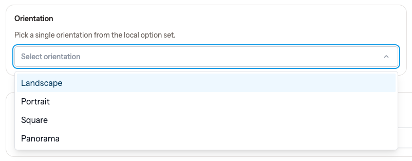

# Livewire Async Select

A powerful async select component for Laravel Livewire with Alpine.js - a modern, lightweight alternative to Select2.

[](https://packagist.org/packages/drpshtiwan/livewire-async-select)
[](https://packagist.org/packages/drpshtiwan/livewire-async-select)
[](https://packagist.org/packages/drpshtiwan/livewire-async-select)

## 🎥 Demo

[](https://www.youtube.com/watch?v=xwfKgZu49gg)

**[▶️ Watch Full Demo on YouTube](https://www.youtube.com/watch?v=xwfKgZu49gg)**

## ✨ Features

- 🚀 **Asynchronous Loading** - Load options dynamically from API endpoints
- 🔍 **Search & Filter** - Built-in search with debouncing
- 🎯 **Multiple Selection** - Beautiful chip/tag display
- ⚡ **Alpine.js Powered** - Lightweight, no jQuery dependency
- 🎨 **Styled with Tailwind CSS** - Pre-built styles with `las-` prefix
- 🎭 **Custom Slots** - Fully customizable rendering
- 📦 **Easy Integration** - Native Livewire component
- 🔄 **Two-way Binding** - Full wire:model support
- 🔒 **No Style Conflicts** - All classes prefixed with `las-`

## 📚 Documentation

**[📖 Full Documentation](https://livewire-select.thejano.com/)**

Complete guides, examples, and API reference available at:

### **[https://livewire-select.thejano.com/](https://livewire-select.thejano.com/)**

To build and view the documentation locally, see **[DOCS.md](DOCS.md)**.

## ⚡ Quick Install

1. **Install via Composer:**

```bash
composer require drpshtiwan/livewire-async-select
```

2. **Publish the CSS assets:**

```bash
php artisan vendor:publish --tag=async-select-assets
```

3. **Setup your layout (important!):**

```blade
<head>
    @asyncSelectStyles
    @livewireStyles
</head>
<body>
    {{ $slot }}
    
    @livewireScripts
    @stack('scripts')  {{-- Required! --}}
</body>
```

> **⚠️ Important:** The `@stack('scripts')` directive is required for the component to work properly.

## 🎯 Basic Usage

```blade
<livewire:async-select
    name="user_id"
    wire:model="selectedUser"
    endpoint="/api/users/search"
    placeholder="Search users..."
/>
```

**[→ View full documentation](https://livewire-select.thejano.com/)**

## 📋 Requirements

- PHP 8.1+
- Laravel 10.x, 11.x, or 12.x
- Livewire 3.3+

## 🆚 Why This Package?

| Feature | Livewire Async Select | Select2 |
|---------|----------------------|---------|
| jQuery Dependency | ❌ No | ✅ Yes |
| Livewire Integration | ✅ Native | ⚠️ Manual |
| Bundle Size | 🟢 Small | 🟡 Large |
| Modern Stack | ✅ Yes | ❌ Legacy |

## 🤝 Contributing

Contributions are welcome! Please see the [documentation](https://drpshtiwan.github.io/livewire-async-select/) for details.

## 📄 License

The MIT License (MIT). Please see [License File](LICENSE) for more information.

## 🙏 Credits

- [Dr. Pshtiwan Mahmood](https://github.com/drpshtiwan)
- [All Contributors](https://github.com/drpshtiwan/livewire-async-select/contributors)

## 🔗 Links

- **[📚 Documentation](https://livewire-select.thejano.com/)**
- **[📦 Packagist](https://packagist.org/packages/drpshtiwan/livewire-async-select)**
- **[🐛 Issues](https://github.com/drpshtiwan/livewire-async-select/issues)**
- **[💬 Discussions](https://github.com/drpshtiwan/livewire-async-select/discussions)**
